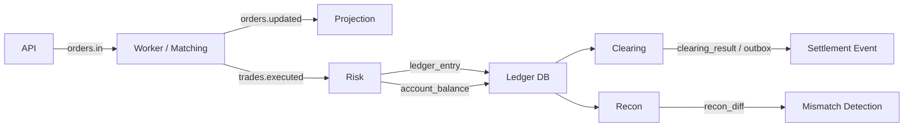

# TradingGate Backend

TradingGate Backend는 주문 접수, 매칭, 원장 기록, 잔고 Projection, 정산, 대사를 하나의 흐름으로 연결한 트레이딩 코어 백엔드다.

이 프로젝트는 단순히 주문 API를 구현하는 데서 끝나지 않는다.  
핵심 관심사는 아래 두 가지다.

- **거래 이벤트를 어떻게 안정적으로 처리할 것인가**
- **돈의 이동을 어떻게 검증 가능한 구조로 유지할 것인가**

특히 이 프로젝트에서는 `ledger_entry`를 **SSOT (Single Source of Truth)** 로 두고, `account_balance`를 Projection으로 분리하는 구조를 중심에 둔다.

---

## 핵심 목표

### 1. 트레이딩 코어의 역할 분리

시스템은 크게 네 역할로 분리된다.

- `api`: 주문 요청을 받아 Kafka로 전달
- `worker`: 주문을 소비하고 매칭 수행
- `risk`: 체결 이벤트를 원장과 잔고로 정규화
- `clearing`: 정산, 대사, outbox 후처리 담당

실시간 경로와 배치/검증 경로를 분리해서, 각 계층이 자신의 책임만 갖도록 설계했다.

### 2. 원장 중심 정합성

TradingGate는 Projection(`account_balance`)을 신뢰의 기준으로 두지 않는다.

- `ledger_entry` = 돈의 이동에 대한 영구 기록
- `account_balance` = 조회용 Projection

즉, 잔고는 빠르게 보여주기 위한 결과물이고, 기준은 항상 원장이다.

### 3. 계산과 검증의 분리

정산과 대사는 이름은 비슷하지만 역할이 다르다.

- **Clearing**: 원장을 기준으로 특정 시점의 스냅샷을 계산
- **Recon**: 원장과 Projection이 일치하는지 검증

이 둘을 분리해야 장애 분석과 재처리 정책이 단순해진다.

---

## 시스템 흐름



### 실시간 경로

1. `api`가 주문 요청을 받고 `orders.in`으로 발행
2. `worker`가 주문을 소비해 매칭 수행
3. `worker`가 `orders.updated`, `trades.executed` 발행
4. `projection`이 `orders.updated`, `trades.executed`를 받아 `trading_order`, `trading_trade` 갱신
5. `risk`가 `trades.executed`를 받아 `ledger_entry`, `account_balance` 갱신

### 배치/검증 경로

1. `clearing`이 `ledger_entry`를 기준으로 배치 스냅샷 계산
2. `recon`이 `ledger_entry`와 `account_balance`를 직접 비교
3. outbox를 통해 정산 결과 이벤트를 발행

---

## 모듈 구성

### Trading

- 주문 API
- 주문/체결 Projection
- 요청 검증
- Kafka 기반 주문 발행

문서:
- `/Users/kimbyungchan/Documents/trading/TradingGate Backend/src/main/java/org/tradinggate/backend/trading/README.md`

### Risk

- `trades.executed` 소비
- `ledger_entry` 기록
- `account_balance` Projection 갱신
- 기본 리스크 제어 및 이상 감지

문서:
- `/Users/kimbyungchan/Documents/trading/TradingGate Backend/src/main/java/org/tradinggate/backend/risk/README.md`

### Settlement Integrity

- B-5 Clearing
- B-6 Reconciliation
- 워터마크 기반 정산
- 원장 vs Projection 대조

문서:
- `/Users/kimbyungchan/Documents/trading/TradingGate Backend/src/main/java/org/tradinggate/backend/settlementIntegrity/README.md`
- `/Users/kimbyungchan/Documents/trading/TradingGate Backend/src/main/java/org/tradinggate/backend/settlementIntegrity/TESTING_REPORT.md`

---

## B-5 / B-6 설계 요약

### B-5 Clearing

- `(account_id, asset)` 단위 정산
- `ledger_entry` 기준 cumulative snapshot
- `max_ledger_id` 워터마크 기반 배치 기준점 고정
- `closing_balance`는 Projection이 아니라 원장 누적합 기준
- carry-over 계정 포함
- 동일 배치 재실행 시 동일 결과 보장

### B-6 Recon

- `SUM(ledger_entry.amount)` vs `account_balance.total` 직접 비교
- stale diff 제거
- 자산별 precision normalization
- Kafka 직접 consume 없음

핵심은 정산도 검증도 **DB 기반**으로 한다는 점이다.

---

## 왜 Kafka 기반 정산이 아니라 DB 기반 정산인가

정산과 대사는 처리량보다 **결정론성**이 더 중요하다.

Kafka 직접 소비 기반으로 정산을 구성하면 아래 문제가 커진다.

- offset 기준점 설명 어려움
- rebalance/retry 시점에 따른 결과 흔들림
- 실시간 유입 이벤트와 배치 스냅샷 혼합

그래서 이 프로젝트에서는:

- B-1에서 이벤트를 DB 원장으로 정규화
- B-5/B-6는 DB 상태만 기준으로 계산/검증

이 구조를 택했다.

---

## 런타임 프로필

실행 프로필은 아래처럼 나뉜다.

- `api`
- `worker`
- `risk`
- `clearing`
- `projection`

`recon`은 별도 런타임 프로세스로 떼지 않고 `clearing`에 포함시켰다.  
이유는 둘 다 Kafka 직접 consume이 아닌 백오피스/배치 성격이기 때문이다.

---

## 배포 구성

### 1. App-only Local K8s

앱만 Kubernetes에 올리고, Kafka / Redis / Postgres는 외부 인프라를 바라보는 구조.

문서:
- `/Users/kimbyungchan/Documents/trading/TradingGate Backend/k8s/local/README.md`

### 2. All-in-K8s Demo

포트폴리오/데모 재현성을 위해 앱과 인프라를 모두 로컬 Kubernetes에 올리는 구성.

구성:
- `api`
- `worker`
- `projection`
- `risk`
- `clearing`
- `trading-postgres`
- `ledger-postgres`
- `redis`
- `kafka` (single-node Redpanda)

문서:
- `/Users/kimbyungchan/Documents/trading/TradingGate Backend/k8s/local-all/README.md`

### 3. 운영(EKS) 가정

실제 운영이라면 앱은 EKS에 올리고, 상태 저장 인프라는 관리형으로 분리하는 것이 더 현실적이다.

- 앱: EKS
- DB: RDS(Postgres)
- Redis: ElastiCache
- Kafka: MSK 또는 외부 Kafka

즉, 로컬 데모와 운영 가정을 분리해서 설명할 수 있도록 구성했다.

---

## 테스트 / 검증 전략

이 프로젝트는 테스트를 세 층으로 나눴다.

### 1. 자동화 테스트

- Unit Test
- Repository Test (PostgreSQL / Testcontainers)
- Integration Test (Runner / Service / DB 시나리오)

### 2. 런타임 검증

- `api / worker / risk / clearing / projection` 동시 기동
- 실제 주문 생성
- Kafka 메시지 흐름 확인
- `trading_order`, `trading_trade`, `ledger_entry`, `account_balance`,
  `clearing_batch`, `clearing_result`, `recon_batch`, `recon_diff` 직접 확인

### 3. 부하 테스트

별도 `loadtest` 디렉터리에서 정리했다.

- `k6` smoke / ramp / soak
- Kafka burst
- clearing / recon benchmark

문서:
- `/Users/kimbyungchan/Documents/trading/TradingGate Backend/loadtest/README.md`

---

## 실제로 검증한 것

이번 작업에서는 아래를 실제로 확인했다.

- `api -> worker -> projection -> risk -> clearing/recon` 전체 흐름
- `ledger_entry`와 `account_balance` 정합성
- `clearing_result` 생성
- `recon_diff = 0` 정상 케이스
- local Kubernetes 배포
- all-in-k8s 데모 배포
- Kafka down/up 장애 시 API fail-fast 동작
- smoke / ramp / soak / burst / batch benchmark

---

## 현재 제한사항

- 매칭 엔진은 현재 **정수 수량 기준**으로만 안전하다.
- 따라서 데모/부하 테스트는 `quantity=1` 기준으로 검증했다.
- 소수 수량 지원은 별도 개선 이슈다.

---

## 빠른 시작

### 로컬 개발

```bash
docker compose up -d
./gradlew bootRun --args='--spring.profiles.active=api'
./gradlew bootRun --args='--spring.profiles.active=worker'
./gradlew bootRun --args='--spring.profiles.active=risk'
./gradlew bootRun --args='--spring.profiles.active=clearing'
./gradlew bootRun --args='--spring.profiles.active=projection'
```

### 로컬 K8s 데모

```bash
docker build -t tradinggate-backend:local .
cp k8s/local-all/secret.sample.yaml k8s/local-all/secret.yaml
kubectl apply -f k8s/local-all/secret.yaml
kubectl apply -k k8s/local-all
```

---

## 문서 링크

- Trading: `/Users/kimbyungchan/Documents/trading/TradingGate Backend/src/main/java/org/tradinggate/backend/trading/README.md`
- Risk: `/Users/kimbyungchan/Documents/trading/TradingGate Backend/src/main/java/org/tradinggate/backend/risk/README.md`
- Settlement Integrity: `/Users/kimbyungchan/Documents/trading/TradingGate Backend/src/main/java/org/tradinggate/backend/settlementIntegrity/README.md`
- Settlement Testing Report: `/Users/kimbyungchan/Documents/trading/TradingGate Backend/src/main/java/org/tradinggate/backend/settlementIntegrity/TESTING_REPORT.md`
- Load Test: `/Users/kimbyungchan/Documents/trading/TradingGate Backend/loadtest/README.md`
- Local K8s: `/Users/kimbyungchan/Documents/trading/TradingGate Backend/k8s/local/README.md`
- Local All-in-K8s: `/Users/kimbyungchan/Documents/trading/TradingGate Backend/k8s/local-all/README.md`

---

## 마무리

TradingGate Backend는 단순 주문 서버가 아니라,
**실시간 처리 계층과 원장 기반 정합성 계층을 분리해서 설계한 트레이딩 백엔드**다.

이 프로젝트에서 가장 중요한 것은 기능 개수보다 다음이다.

- 원장을 기준으로 계산한다.
- Projection은 검증 대상이다.
- 배치는 워터마크 기준으로 결정론적으로 동작한다.
- 로컬에서도 전체 구조를 재현하고 검증할 수 있다.

이 네 가지를 코드, 테스트, 배포 구성까지 연결해서 보여주는 것이 이 프로젝트의 핵심이다.
