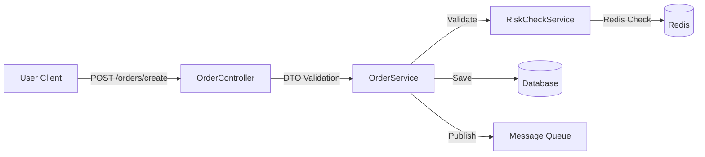

# TradingGate Trading System Module

## 📖 개요
**TradingGate Trading System**은 고성능 주문 처리와 리스크 관리를 담당하는 핵심 백엔드 모듈입니다.  
사용자의 주문 요청을 안정적으로 처리하고, 실시간 리스크 검증을 수행하며, 체결 내역을 효율적으로 제공하는 것을 목적으로 합니다.

- **High Availability**: 비동기 주문 처리(Async)를 통해 대량의 트래픽에도 안정적인 응답 속도 보장
- **Risk Management**: Redis 기반의 실시간 리스크 모니터링 및 자동차단 시스템 적용
- **Layered Architecture**: Controller, Service, Domain 계층의 명확한 분리로 유지보수성 향상

---

## 🔬 핵심 구성 요소 및 역할

| 컴포넌트 (Component) | 패키지 (Package) | 주요 역할 및 책임 |
|-------------------|------------------|-------------------|
| **API Controller** | `api/controller` | HTTP 요청 진입점, 요청 검증(`@Valid`), 비동기 응답(`202 Accepted`) 반환 |
| **Order Service** | `service` | 주문 생명주기 관리, 매칭 엔진 연동, 주문 상태 변경 로직 수행 |
| **Risk Engine** | `service/RiskCheckService` | **Pre-trade Risk Check**: 주문 실행 전 한도 및 규정 위반 여부 검증 |
| **Query Service** | `service/*QueryService` | 읽기 전용 트랜잭션 최적화, 대용량 주문/체결 내역 조회 처리 |

---

## 🧠 시스템 아키텍처

### 1. Order Processing Flow
사용자의 주문 요청이 처리되는 데이터 흐름입니다.



### 2. Risk Management Rules
`RiskCheckService`는 Redis를 활용하여 다음 규칙을 실시간으로 강제합니다.

- **🚫 User Blocking**: 규정 위반 사용자 즉시 거래 차단
- **💰 Daily Volume Limit**: 일일 누적 거래금액 **100,000,000** 초과 시 차단
- **🔢 Daily Count Limit**: 일일 주문 횟수 **1,000회** 초과 시 차단
- **⚡ Rate Limit**: 분당 주문 **10회** 초과 시 일시 제한

---

## 📂 디렉토리 구조

```
src/main/java/org/tradinggate/backend/trading/
│
├── 📁 api/                      # Presentation Layer
│   ├── 📁 controller/           # API Endpoints (Order, Query)
│   ├── 📁 dto/                  # Data Transfer Objects (Request/Response)
│   └── 📁 validator/            # Custom Validation Logic
│
├── 📁 service/                  # Business Layer
│   ├── OrderService.java        # 주문 생성/취소 핵심 로직
│   ├── OrderQueryService.java   # 주문 조회 최적화 로직
│   ├── TradeQueryService.java   # 체결 내역 조회 로직
│   └── RiskCheckService.java    # 리스크 관리 및 Redis 연동
│
├── 📁 domain/                   # Domain Entities
│   └── (Order, Trade Entity...)
│
├── 📁 config/                   # Configuration
│   └── (Trading Configs...)
│
└── 📘 README.md                 # 현재 문서
```

---

## 🚀 API 사용 가이드

본 모듈은 RESTful API를 제공하며, Notion에 기술된 [Trading API 명세]를 준수합니다.

### 1. 주문 생성 (Order Creation)
- **Endpoint**: `POST /api/orders/create`
- **Response**: `202 Accepted` (비동기 처리)

```json
// Request Body Example
{
  "clientOrderId": "req-12345",
  "symbol": "BTC/USDT",
  "side": "BUY",
  "type": "LIMIT",
  "price": 50000.0,
  "quantity": 0.1
}
```

### 2. 주문 취소 (Cancel Order)
- **Endpoint**: `POST /api/orders/cancel`
- **Response**: `202 Accepted`

```json
// Request Body Example
{
  "clientOrderId": "req-12345",
  "symbol": "BTC/USDT"
}
```

### 3. 데이터 조회 (Query)
- **Open Orders**: `GET /api/orders/open`
- **Order History**: `GET /api/orders/history`
- **Trade History**: `GET /api/trades/history`

---

## 🛠️ 향후 개선 계획

- [ ] **JWT Authentication**: 현재 하드코딩된 `userId`를 Security Context 기반으로 변경
- [ ] **Complex Order Types**: Stop-Loss, OCO 등 특수 주문 유형 지원 추가
- [ ] **Circuit Breaker**: 급격한 변동성 발생 시 시스템 전체 주문 차단 기능 도입
- [ ] **Performance Tuning**: Redis Pipeline 도입을 통한 리스크 체크 지연 시간 최소화

---

## 📧 Contact
트레이딩 시스템 관련 문의는 Backend 팀 채널을 이용해 주세요.
